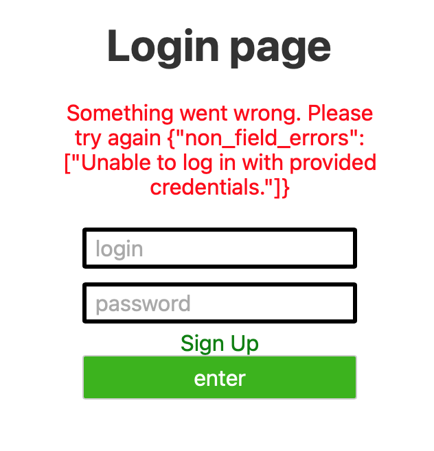
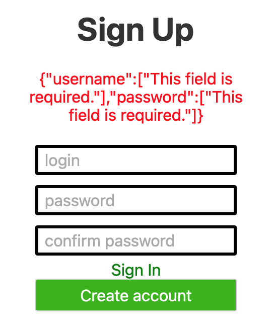
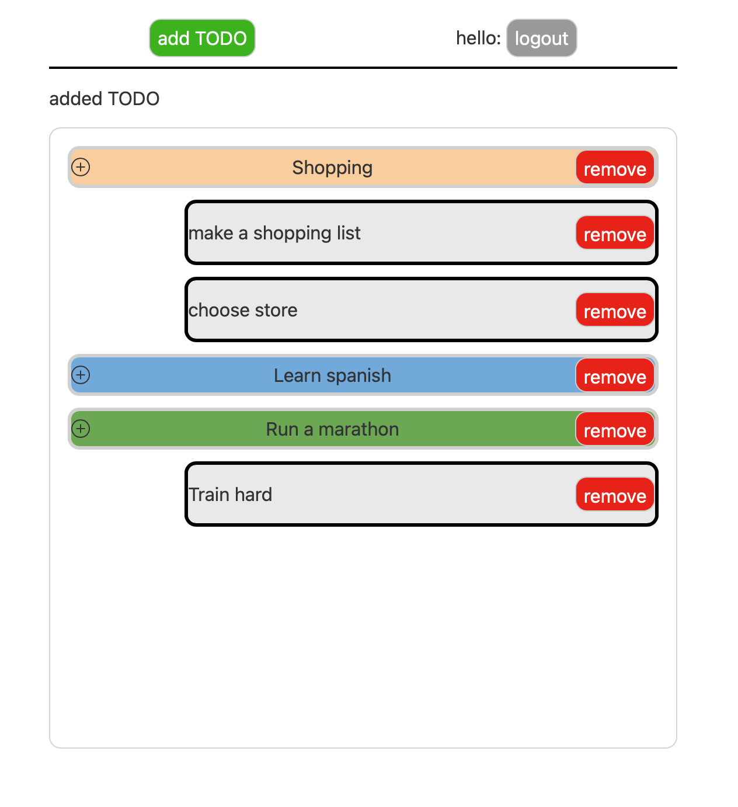
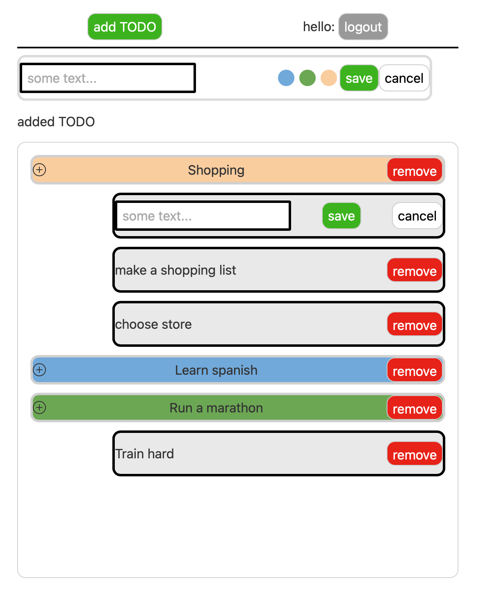

Todo project

django (rest-api) + postgresQL + svelte








installation:

project:

open terminal and paste 

```git clone https://github.com/avmepy/todo.git```

```cd todo```

```python3 -m pip install --user virtualenv```

```python3 -m venv env```

```source env/bin/activate```

```pip install -r requirements.txt```


database:

docker and macOS in my case

download docker from
```https://docs.docker.com/docker-for-mac/install/```

then via terminal

```docker pull postgres```

```docker run -e POSTGRES_PASSWORD=postgres -e POSTGRES_USERNAME=postgres -it --rm -p 5432:5432 -d --name pg postgres```

```brew install libpq```

```brew link --force libpq ail```

```export PGPASSWORD=postgres```

```psql -h localhost -U postgres -w```

```CREATE DATABASE pg;```

to start server:

```python manage.py runserver```

to start front:

```cd frontend```

```npm run dev```
